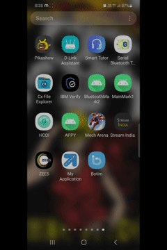
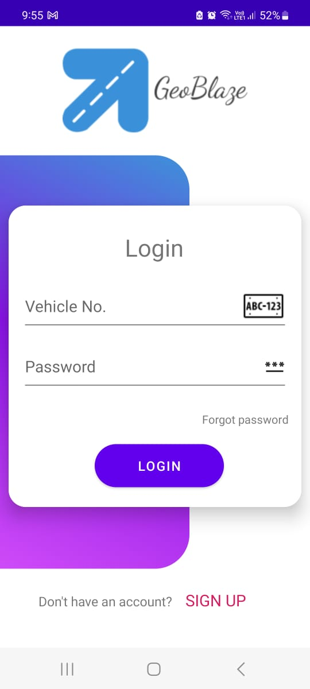
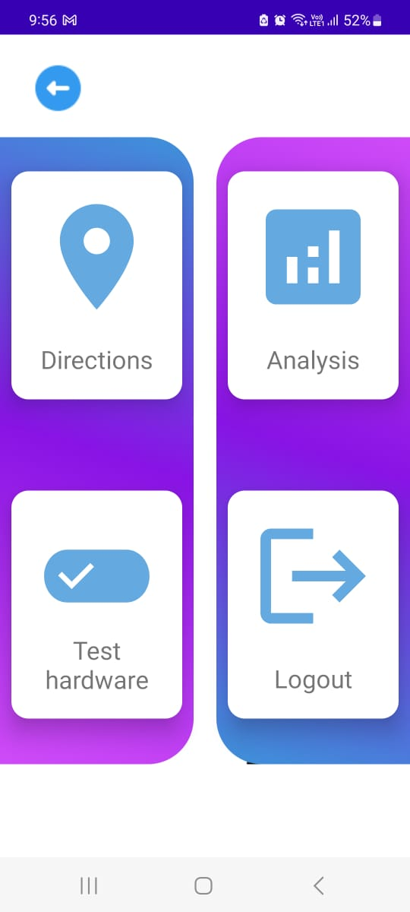

# GeoBlaze - Android App 📲  
### *An IoT-based Smart Vehicle Indicator Automation System*

[🔗 View ESP32 Firmware Repository → GeoBlaze-ESP32](https://github.com/Zia-Mahmood/GeoBlaze-ESP32)

---

## 📘 Overview
The **GeoBlaze Android App** serves as the **master control unit** for the GeoBlaze ecosystem.  
It uses **Google Maps API** to fetch real-time navigation routes, determines the **next turn**, and sends Bluetooth serial commands (`L` / `R`) to the ESP32 for automatic signal control.

The app provides a **live map interface**, **motion tracking**, and **toast-based notifications** for each activated turn, ensuring a distraction-free riding experience.

---

## 🧱 Core Architecture

| Component | Role |
|------------|------|
| **Google Maps API** | Provides real-time navigation and turn prediction |
| **Android App (Java)** | Processes turn logic and sends commands via Bluetooth |
| **ESP32 Firmware** | Executes received commands through relay-controlled indicators |

---

## 🧰 Tech Stack
- **Language:** Java  
- **Framework:** Android Studio  
- **Communication:** Bluetooth Classic (Serial)  
- **API:** Google Maps SDK for Android  

---

## ⚙️ Setup Instructions

### 1. Clone Repository
```bash
git clone https://github.com/Zia-Mahmood/GeoBlaze-Android.git
````

### 2. Open in Android Studio

* File → Open → select this folder
* Wait for Gradle sync

### 3. Add Google Maps API Key

Add your Maps API key in `AndroidManifest.xml`:

```xml
<meta-data
    android:name="com.google.android.geo.API_KEY"
    android:value="YOUR_API_KEY_HERE"/>
```

### 4. Build & Run

* Connect your Android phone
* Pair with ESP32
* Launch **GeoBlaze App**
* Start navigation → observe automatic signaling

---

## 🧪 Demo

### 📱 App Interaction
[Google Drive Link](https://drive.google.com/file/d/1WtmUDDjg7xVTShBiGUPVRhIEMigdYvJX/view?usp=sharing)



---

### 🏍️ Real Bike Implementation 
[Google Drive Link](https://drive.google.com/file/d/1k_8Ny_jzUUArPhIODR5X-xLXiLAKU4JY/view?usp=sharing)


---

### 🗺️ App Screenshots           

<p align="center">
  
  &nbsp;&nbsp;&nbsp;
  
</p>

---

## 💬 Issues & Contributions

If you find a bug or want to suggest improvements,
open an issue [here](https://github.com/Zia-Mahmood/GeoBlaze-Android/issues).
Pull requests for feature additions are welcome.

---

## 🔭 Future Scope

* Add voice-guided notifications
* Integrate sensor-based gesture detection for signaling
* Create dashboard app for trip summaries and logs
* Cloud sync for analytics of signal usage and route behavior

---

## 📜 License

This project is licensed under the [MIT License](LICENSE).

---

## 👨‍💻 Maintainer

**Zia Mahmood Hussain**
[LinkedIn](https://www.linkedin.com/in/yourprofile) • [GitHub](https://github.com/<your-username>)
